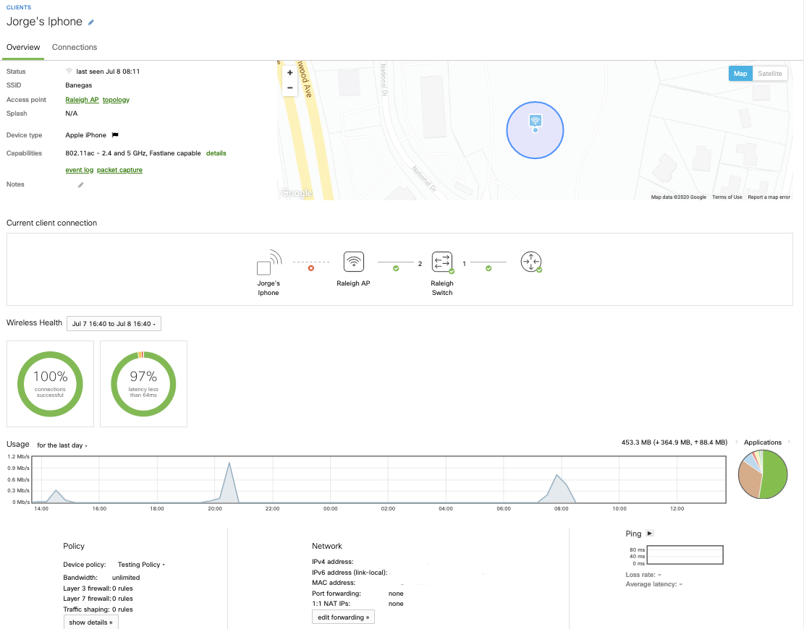
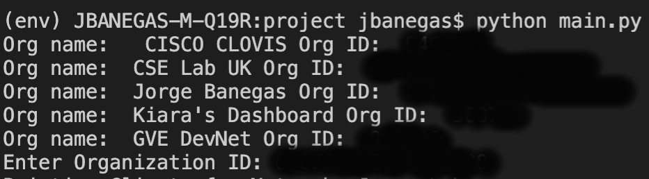
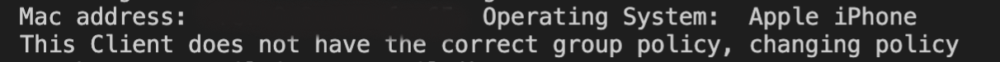
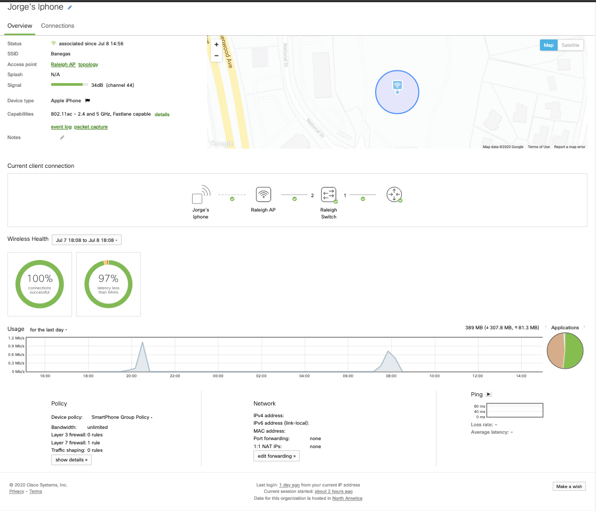
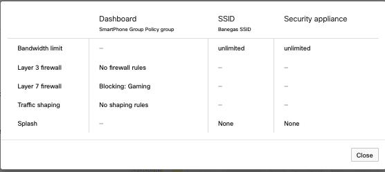
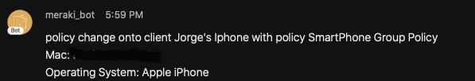

# meraki_group_policy_device_assignment
Script to dynamically assign group policies to IOS or Android clients. 


## Contacts
* Jorge Banegas

## Solution Components
* Meraki Dashboard API Python Library - https://github.com/meraki/dashboard-api-python/
* Webex Teams API Python Library - https://github.com/CiscoDevNet/webexteamssdk

## Installation/Configuration
1. Generate a Meraki API Key - https://documentation.meraki.com/zGeneral_Administration/Other_Topics/The_Cisco_Meraki_Dashboard_API#:~:text=Enable%20API%20access,-For%20access%20to&text=After%20enabling%20the%20API%2C%20go,API%20key%20on%20your%20profile.

2. Create a Webex Teams Bot key - https://developer.webex.com/docs/bots

3. Create the Webex Teams Room ID - https://developer.webex.com/docs/api/v1/rooms/list-rooms (add the bot to the desired space)

4. Pull down the project into a python virtual environment

```
git clone https://wwwin-github.cisco.com/gve/meraki_group_policy_device_assignment.git
```

5. Install the required packages

```
pip install -r requirements.txt
```

5. Edit the credentials files to include the api key, room id and the access token for Webex and Meraki

```python
api_key = ""
access_token = ""
room_id = ""
```
6. Edit the policy name in which you want to provision for the clients (line 44)

```python

provision_policy = "SmartPhone Group Policy"

```

6. Run the main.py script 
```
python app.py
```

# Running this script in a repetitive interval 
Visit the link below if you need intructions to run this script in a timed interval (make sure to make edits to select the org id without user input)

https://phoenixnap.com/kb/set-up-cron-job-linux


# Screenshots
- This is a client's page before running the script 



- Step 1 : Script will ask user to select the organization to provision



- Step 2 : Script will look at all the clients (last 24 hrs) and apply the policy to those needed clients



- Client's page after running the script



- Client's policy page



- Webex Message 




### LICENSE

Provided under Cisco Sample Code License, for details see [LICENSE](LICENSE.md)

### CODE_OF_CONDUCT

Our code of conduct is available [here](CODE_OF_CONDUCT.md)

### CONTRIBUTING

See our contributing guidelines [here](CONTRIBUTING.md)

#### DISCLAIMER:
<b>Please note:</b> This script is meant for demo purposes only. All tools/ scripts in this repo are released for use "AS IS" without any warranties of any kind, including, but not limited to their installation, use, or performance. Any use of these scripts and tools is at your own risk. There is no guarantee that they have been through thorough testing in a comparable environment and we are not responsible for any damage or data loss incurred with their use.
You are responsible for reviewing and testing any scripts you run thoroughly before use in any non-testing environment.
